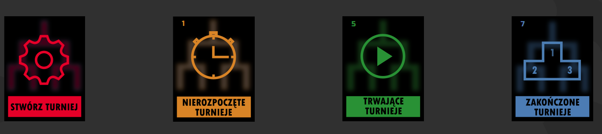
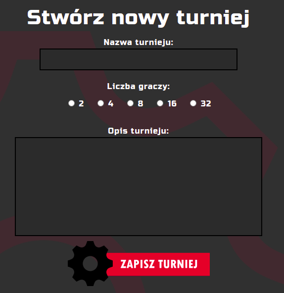
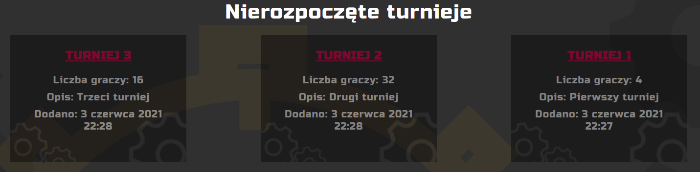
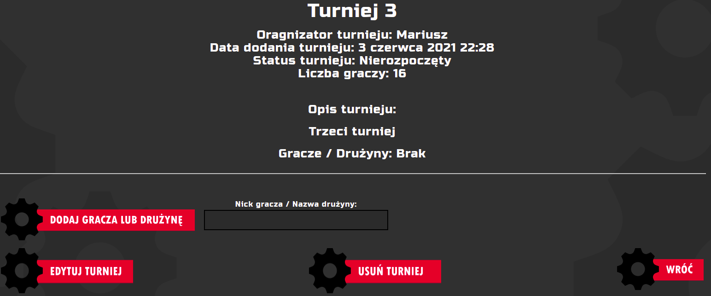
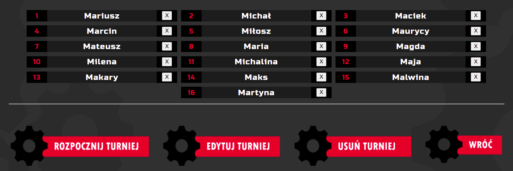
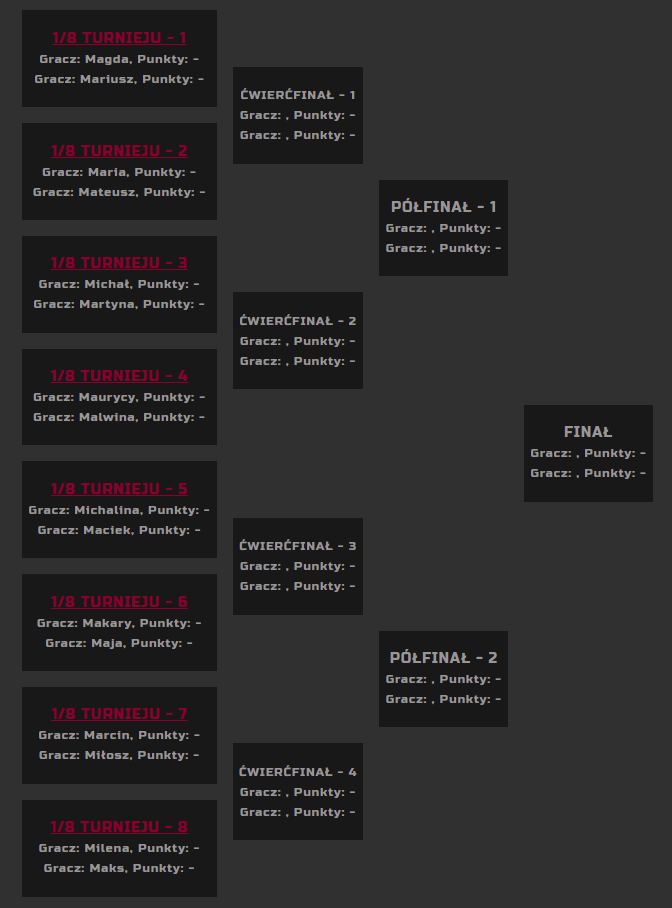

#  Tournament Organizer
## Mariusz Rogawski

---

### General info

Tournament organizer is a web application written in Django for quickly creating and managing tree tournaments.
After registering and logging in to the website, the tournament organizer has access to four main tabs:
- create a tournament
- pending tournaments
- ongoing tournaments
- tournaments completed

After cloning the project on your computer and entering the project folder in the terminal, please enter the command:

    $ pip install -r requirements.txt 

to install all the necessary libraries for the script to run properly.

### Technologies
- Python 3.8
- Django 3.2 
- HTML 5
- CSS 3
---
###Description of the application with examples
After registering and logging in to the website, you can see the main screen with the four most important tabs:
- create a tournament,
- tournaments not started, 
- ongoing tournaments, 
- completed tournaments.

    pic.1 Main tabs

###"Create tournament" tab
In the "create a tournament" subpage (pic. 2), provide basic information about the tournament:
- tournament name
- the number of players
- tournament description
After entering the data, save the tournament, and it will automatically go to the "tournaments not started" tab.

    pic.2 Create new tournament

###"Pending tournaments" tab
In the "pending tournaments" subpage there is a list of all saved tournaments (pic. 3) that are waiting for the entry of 
participants and for its start. Therefore, select the tournament and enter the names of the players or teams, and then 
start the tournament (pic. 4, 5). At this stage, it is also possible to edit the tournament in order to change the name 
of the tournament, the number of players or the description of the tournament, as well as delete the tournament.
After the tournament starts, it is automatically moved to the "tournaments in progress" tab.

    pic.3 List of pending tournament

    pic.4 Pending tournament view

    pic.5 Entered player names

###"Tournaments in progress" tab
There is a list of all started tournaments in the "ongoing tournaments" subpage. After selecting a specific tournament, 
the organizer is moved to the tournament view, which shows basic information about the tournament and the generated 
tournament tree (pic. 6), for which pairs of players or teams were drawn.
In the tournament tree, pairs of players or teams are displayed along with the score and a link to a specific match. 
The link is only active when a pair of players or teams are assigned to the match.
By clicking on the match link, the organizer is transferred to the match details, where he can enter the match results 
and save it, and add a text report from the match or a video from the match shared on YouTube. In the case of video 
sharing, it is important that the video on YouTube has the "Allow upload to other sites" check box unchecked in the 
settings.
After entering the result and saving it, the winnings are automatically transferred to the next phase of the tournament.
The record of the final result is associated with the selection of the tournament winner and the automatic transfer of 
the tournament to the "tournaments completed" tab.
The organizer has the option of making the tournament and the match available to participants so that everyone can 
view it. Participants without logging in cannot edit the tournament or add new tournaments.

    pic.5 View of the generated tournament tree

###"Completed tournaments" tab
In the "tournaments completed" tab, there is a list of the tournaments in which the finals were held. This tab is the 
history of the tournaments held, where you can view the details of the tournaments and matches.

###Implementation
The developed application was implemented under the name Tournaments Organizer on the PythonAnywhere hosting platform, 
so you can test the application at http://tournamentsorganizer.pythonanywhere.com